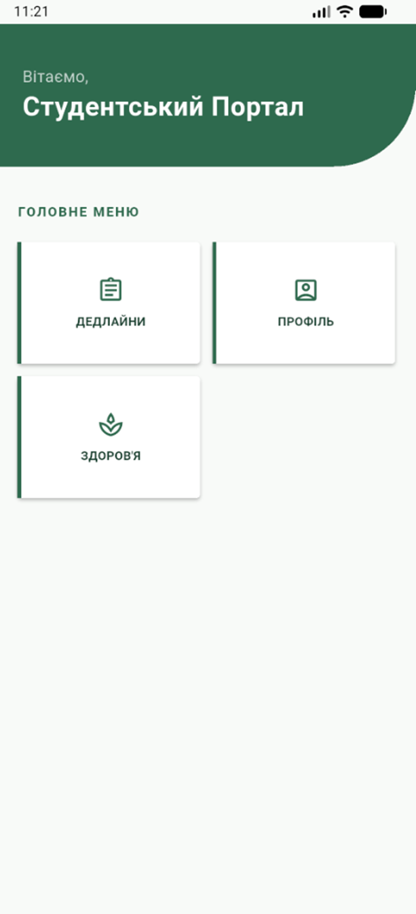
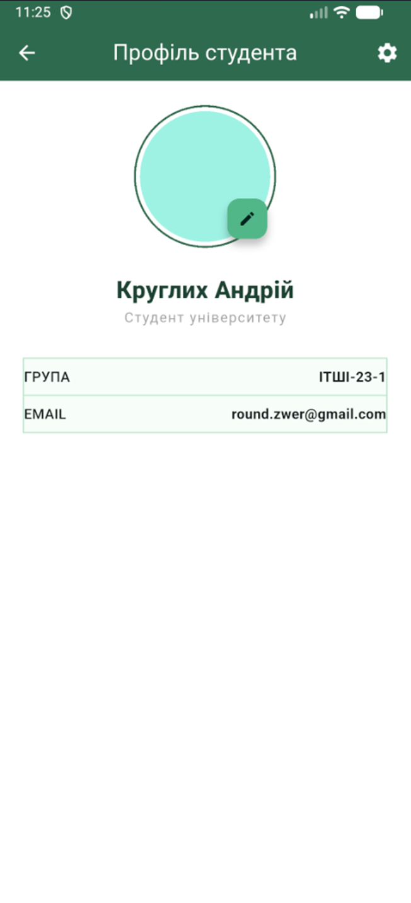
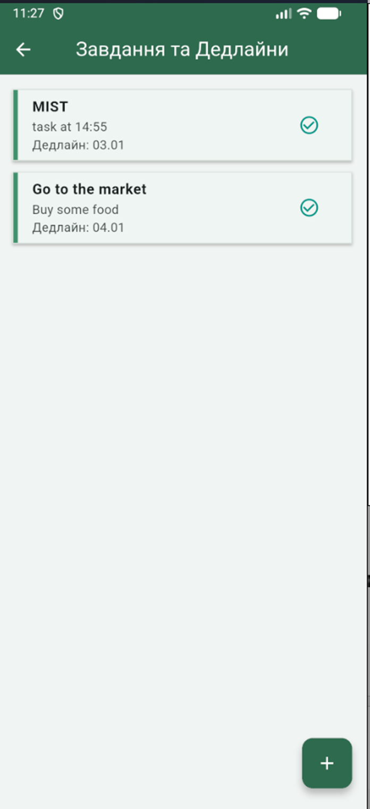
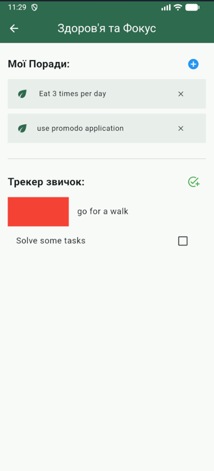

# Student Portal - Flutter Mobile Application

A comprehensive mobile application built with **Flutter** and **Dart** designed to help students manage their academic and personal lives. This project demonstrates the implementation of a multi-screen architecture, persistent local storage, and interactive UI components.

---

## 🎯 Project Goal
The primary objective of this project was to master the Flutter development lifecycle, including widget tree management, navigation stacks, and adaptive interface design according to **Material Design** principles.

## Functionality
* **Task Management:** Create, view, and delete academic assignments with persistent storage.
* **Profile Customization:** Edit student information (name, group, email) and upload a profile picture from the gallery.
* **Health Tracker:** Monitor daily habits and access wellness tips specifically for students.
* **Local Data Persistence:** All user data is saved locally using SharedPreferences and JSON encoding.
* **Error Handling:** Robust processing of data loading and local file paths.

## 🛠️ Technologies Used

* **Framework:** Flutter.
* **Language:** Dart.
* **Storage:** `shared_preferences` for persistent local data.
* **Media & Files:** `image_picker`, `path_provider`, and `path` for profile photo management.
* **Data Handling:** `dart:convert` for JSON serialization of tasks and habits.

## 📱 Project Structure

The application is organized into a clean, screen-based architecture:
* `home_screen.dart`: The entry point and main menu with navigation routes.
* `tasks_screen.dart`: Logic for adding, deleting, and storing student tasks.
* `profile_screen.dart`: User information management and image handling.
* `health_screen.dart`: Wellness tips and an interactive habit tracker.

## ⚙️ Installation & Setup

1.  **Clone the repository:**
    ```bash
    git clone [https://github.com/andrewsis/student-portal-flutter.git](https://github.com/andrewsis/student-portal-flutter.git)
    ```
2. Open this project in Android studio and launch emulator
3.  **Install dependencies:**
    ```bash
    flutter pub get
    ```
4.  **Run the application:**
    ```bash
    flutter run
    ```

## Screenshots
1. Main dashboard


---
2. Profile


---
3. Tasks


---
4. Health

---
*Developed as a practical university project to demonstrate proficiency in Flutter mobile development.*